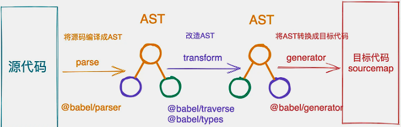

### babel 是什么

> babel简介

Babel 是一个 JavaScript 编译器
Babel 是一个工具链，主要用于将采用 ECMAScript 2015+ 语法编写的代码转换为向后兼容的 JavaScript 语法，以便能够运行在当前和旧版本的浏览器或其他环境中。下面列出的是 Babel 能为你做的事情：



- parse： 用于将源代码编译成AST抽象语法树
- transform： 用于对AST抽象语法树进行改造
- generator： 用于将改造后的AST抽象语法树转换成目标代码

很明显AST抽象语法树在这里充当了一个中间人的身份，作用就是可以通过对AST的操作还达到源代码到目标代码的转换过程，这将会比暴力使用正则匹配要优雅的多。

### AST抽象语法树

> 在计算机科学中，抽象语法树（Abstract Syntax Tree，AST） 是源代码语法结构的一种抽象表示。它以树状的形式表现编程语言的语法结构，树上的每个节点都表示源代码中的一种结构。

- AST抽象语法树是源代码语法结构的一种抽象表示
- 每个包含type属性的数据结构，都是一个AST节点
- 它以树状的形式表现编程语言的语法结构，每个节点都表示源代码中的一种结构

#### AST结构

> 为了统一ECMAScript标准的语法表达。社区中衍生出了ESTree Spec，是目前前端所遵循的一种语法表达标准

节点类型

| 类型 | 说明 |
| ---- | ---- |
| File | 文件 (顶层节点包含 Program) |
| Program | 整个程序节点 (包含 body 属性代表程序体) |
| Directive | 指令(例如 "use strict") | 
| Comment | 代码注释 |
| Statement | 语句 (可独立执行的语句) |
| Literal | 字面量 (基本数据类型、复杂数据类型等值类型) |
| Identifier | 标识符 (变量名、属性名、函数名、参数名等) |
| Declaration | 声明 (变量声明、函数声明、Import、Export 声明等) |
| Specifier | 关键字 (ImportSpecifier、ImportDefaultSpecifier、ImportNamespaceSpecifier、ExportSpecifier) |
| Expression | 表达式 |

公共属性

| 类型 | 说明 |
| ---- | ---- |
| type | AST 节点的类型 |
| start | 记录该节点代码字符串起始下标 |
| end | 记录该节点代码字符串结束下标 |
| loc | 内含 line、column 属性，分别记录开始结束的行列号 |
| leadingComments | 开始的注释 |
| innerComments | 中间的注释 |
| trailingComments | 结尾的注释 | 
| extra | 额外信息 |

AST是如何生成的
一般来讲生成`AST抽象语法树`都需要javaScript解析器来完成

JavaScript解析器通常可以包含四个组成部分：

- 词法分析器（Lexical Analyser）
- 语法解析器（Syntax Parser）
- 字节码生成器（Bytecode generator）
- 字节码解释器（Bytecode interpreter）

词法分析
这里主要是对代码字符串进行扫描，然后与定义好的 JavaScript 关键字符做比较，生成对应的Token。Token 是一个不可分割的最小单元。
词法分析器里，每个关键字是一个 Token ，每个标识符是一个 Token，每个操作符是一个 Token，每个标点符号也都是一个 Token，词法分析过程中不会关心单词与单词之间的关系.
除此之外，还会过滤掉源程序中的注释和空白字符、换行符、空格、制表符等。最终，整个代码将被分割进一个tokens列表

javaScript中常见的`token`主要有：

```js
let fn = () => {
  console.log('test')
}
```
它在经过词法分析后生成的token是这样的：

```js
[
    {
        "type": "Keyword",
        "value": "let"
    },
    {
        "type": "Identifier",
        "value": "fn"
    },
    {
        "type": "Punctuator",
        "value": "="
    },
    {
        "type": "Punctuator",
        "value": "("
    },
    {
        "type": "Punctuator",
        "value": ")"
    },
    {
        "type": "Punctuator",
        "value": "=>"
    },
    {
        "type": "Punctuator",
        "value": "{"
    },
    {
        "type": "Identifier",
        "value": "console"
    },
    {
        "type": "Punctuator",
        "value": "."
    },
    {
        "type": "Identifier",
        "value": "log"
    },
    {
        "type": "Punctuator",
        "value": "("
    },
    {
        "type": "String",
        "value": "'test'"
    },
    {
        "type": "Punctuator",
        "value": ")"
    },
    {
        "type": "Punctuator",
        "value": "}"
    }
]

```

拆分出来的每个字符都是一个token
语法分析
这个过程也称为解析，是将词法分析产生的token按照某种给定的形式文法转换成AST的过程。也就是把单词组合成句子的过程。在转换过程中会验证语法，语法如果有错的话，会抛出语法错误。
还是上面那段代码，在经过语法分析后生成的AST是这样的：

```js
{
    "type": "VariableDeclaration",  // 节点类型： 变量声明
    "declarations": [   // 声明
      {
        "type": "VariableDeclarator",  
        "id": {
          "type": "Identifier",  // 标识符
          "name": "fn"  // 变量名
        },
        "init": {
          "type": "ArrowFunctionExpression",    // 箭头函数表达式
          "id": null,
          "generator": false,
          "async": false,
          "params": [],  // 函数参数
          "body": {  // 函数体
            "type": "BlockStatement",  // 语句块
            "body": [   
              {
                "type": "ExpressionStatement",  // 表达式语句
                "expression": {
                  "type": "CallExpression", 
                  "callee": {
                    "type": "MemberExpression",
                    "object": {
                      "type": "Identifier",
                        "identifierName": "console"
                      },
                      "name": "console"
                    },
                    "computed": false,
                    "property": {
                      "type": "Identifier",
                      "name": "log"
                    }
                  },
                  "arguments": [  // 函数参数
                    {
                      "type": "StringLiteral",  // 字符串
                      "extra": {
                        "rawValue": "test",
                        "raw": "'test'"
                      },
                      "value": "test"
                    }
                  ]
                }
            ],
            "directives": []
          }
        }
      }
    ],
    "kind": "let"    // 变量声明类型
  }
```